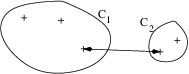

## Preliminary {.unnumbered}

Functions from `R`-base and stats (preloaded) are required plus packages from the **tidyverse** for data representation and manipulation. The package **igraph** is a great library for network data manipulation (interface exists in `Python`). We will also use the package **aricode** for computing clustering metrics. **missSBM** contains our illustrative data set.

```{r tests-config, message = FALSE}
#| code-fold: false
library(tidyverse)
library(corrplot)
library(viridis)
library(igraph)
library(aricode)
library(sbm)
library(missSBM)
theme_set(theme_bw())
```

```{r pdf-setting}
options(tinytex.engine = 'xelatex')
```

## Introduction

### Network data and binary graphs: minimal notation

A **network** is a collection of interacting entities. A **graph** is the mathematical representation of a network.

In what follow, a graph $\mathcal{G}=(\mathcal{V},\mathcal{E})$ is a mathematical structure consisting of

  - a set $\mathcal{V}=\{1,\dots,n\}$ of vertices or **nodes**
  - a set $\mathcal{E}=\{e_1,\dots,e_p:e_k=(i_k,j_k)\in (\mathcal{V}\times\mathcal{V})\}$ of **edges**
  - the number of vertices $|\mathcal{V}|$ is called the **order**
  - the number of edges $|\mathcal{E}|$ is called the **size**
  

The connectivity of a binary undirected (symmetric) graph $\mathcal{G} = (\mathcal{V},\mathcal{E})$ is captured by the $|\mathcal{V}|\times |\mathcal{V}|$ matrix $Y$, called the adjacency matrix
$$
  (Y)_{ij} = \begin{cases}
  1  & \text{ if } i \sim j,\\
  0  & \text{otherwise}.
\end{cases}
$$
For a valued of weighted graph, a similar definition would be

$$
  (Y)_{ij} = \begin{cases}
  w_{ij}  & \text{ if } i \sim j,\\
  0  & \text{otherwise}.
\end{cases}
$$
where $w_{ij}$ is the weight associated with edge $i\sim j$.

### The French political Blogosphere

The `frenchblog2007` data is a network dataset which consists of a single day snapshot of over 200 political blogs automatically extracted the 14 October 2006 and manually classified by the "Observatoire Présidentielle" project. It is part of the **missSBM** package. It is provided as an **igraph** object with 196 nodes. The vertex attribute "party" provides a classification of the nodes.

```{r mixture-fblog-load1}
data("frenchblog2007")
summary(frenchblog2007)
igraph::V(frenchblog2007)$party %>% table() %>% as_tibble() %>% rmarkdown::paged_table()
```

A visual representation of the network data with nodes colored according to the political party each blog belongs to is achieved as follows:

```{r frenchblog-igraph-plot}
#| code-fold: TRUE
plot.igraph(frenchblog2007,
  vertex.color = factor(V(frenchblog2007)$party),
  vertex.label = NA
 )
```

Another commonly used representation is via a matrix view, where the adjacency matrix is re-ordered column-wise and row-wise according to a predefined classification. In the `frenchblog2007` data, nodes are originally reordered according to their party:

```{r frenchblog-matrix-plot}
#| code-fold: TRUE
frenchblog2007 %>% as_adj(sparse = FALSE) %>% plotMyMatrix()
```

:::{.callout-warning}
In this example, one can see that the pattern of connections between the nodes is highly related to the blog classification (the political party). However, just like with any kind of clustering, this is note always the case: the data may support a natural grouping of the node which is not necessarily related a predefined classification.
:::

:::{.callout-note}
For convenience, in the following,

  - we remove the isolated nodes or node with degree equal to one[^1]
  - we denote by $Y$ the adjacency matrix encoding the network
  - we extract the political party of the nodes as a categorical variable 

**Our objective is now to automatically find a partitioning of the node, i.e. a clustering, that groups together nodes with similar connectivity pattern. This is known as graph clustering.**

:::

[^1]: A "nice" side-effect is that the 'far-right' blogs have removed from the study. Amazing for data collected only a decade ago...

```{r export_data}
blog <- frenchblog2007 %>%  delete_vertices(which(degree(frenchblog2007) <= 1))
party <- V(blog)$party %>% as_factor()
Y     <- blog %>% as_adjacency_matrix()
n_nodes <- gorder(blog)
n_edges <- gsize(blog)
party %>% table() %>% as_tibble() %>% rmarkdown::paged_table()
```

## Graph partionning

### Agglomerative Hierarchical Clustering (HAC)

#### General principle

::: {.callout-info}
### HAC: heuristic

The idea of HAC applies naturally to network data just as it applies to standard data set:

  1. Start with small clusters (*e.g.* one cluster $\equiv$ one node)
  2. Merge the most similar clusters sequentially (and greedily)
  3. Stops when all nodes are in the same groups
  
This implies 2 Ingredients

  - a dissimilarity measure (distance between nodes)
  - a merging criterion $\Delta$ (dissimilarity between clusters of nodes)

:::

Given a dissimilarity $d_{ij}$ between a pairs $(i,j)$, the standard merging criterion between two clusters $\mathcal{C}_k$ and $\mathcal{C}_\ell$ based on $d_{ij}$ are the followings:

  - **Single linkage** (or minimum linkage):

$$\Delta(\mathcal{C}_k, \mathcal{C}_\ell) = \min_{\mathbf{x}_i \in \mathcal{C}_k, \mathbf{x}_j \in \mathcal{C}_\ell} d(\mathbf{x}_i, \mathbf{x}_j)
 $$



  - **Complete linkage** (or maximum linkage):
  
$$\Delta(\mathcal{C}_k, \mathcal{C}_\ell) = \max_{\mathbf{x}_i \in \mathcal{C}_k} \max_{\mathbf{x}_j \in \mathcal{C}_\ell}d_{ij}
$$


  - **Average linkage** (or group linkage):

$$\Delta(\mathcal{C}_k, \mathcal{C}_\ell) = \frac{1}{|\mathcal{C}_k||\mathcal{C}_\ell|} \sum_{\mathbf{x}_i \in \mathcal{C}_k}\sum_{\mathbf{x}_ \in\mathcal{C}_\ell} d_{ij}
$$

  - **Ward's criterion** (distance to the mean - 'average' node $\mu_\mathcal{C}$ )
  
$$\Delta(\mathcal{C}_k, \mathcal{C}_\ell) 
 = \sum_{i \in \mathcal{C}_k} \left( d^2(i, \mathbf{\mu}_{\mathcal{C}_k \cup \mathcal{C}_\ell} ) - d^2(i, \mathbf{\mu}_{\mathcal{C}_k}) \right) + \sum_{j \in \mathcal{C}_\ell} \left( d^2(j, \mathbf{\mu}_{\mathcal{C}_j \cup \mathcal{C}_\ell} ) - d^2(j, \mathbf{\mu}_{\mathcal{C}_\ell}) \right) $$

::: {.callout-note}
### Remark

When $d$ is the Euclidean distance, 

$$\Delta(\mathcal{C}_k, \mathcal{C}_\ell) = \frac{2|\mathcal{C}_k||\mathcal{C}_\ell|}{|\mathcal{C}_k|+|\mathcal{C}_\ell|}d^2(\mu_{\mathcal{C}_k}, \mu_{\mathcal{C}_\ell})$$
Then, for two partitions $\mathcal{P}, \mathcal{P}'$ such as = $\mathcal{P}(\mathcal{C}_1, \dots,\mathcal{C}_K)$ is at one level of the hierarchy and $\mathcal{P}'$ is $\mathcal{P}$ once $\mathcal{C}_k, \mathcal{C}_\ell$ merged, we have
    
$$I_W(\mathcal{P}') - I_W(\mathcal{P}) = \frac{|\mathcal{C}_k||\mathcal{C}_\ell|}{|\mathcal{C}_k|+|\mathcal{C}_\ell|}d^2(\mu_{\mathcal{C}_k}, \mu_{\mathcal{C}_\ell}) = \frac{1}{2} \Delta(\mathcal{C}_k, \mathcal{C}_\ell).
$$
where we the inertia measures the homogenity of the size-K clustering

$$I_W = \sum_{k=1}^K \sum_{i \in \mathcal{C}_k} d^2(i,\mu_{\mathcal{C}_k}), \quad I_B = \sum_{k=1}^K n_k d^2(\mu_k, \mu)$$

Thus, at each step, *Ward limits the loss (increase) of the intra (inter) class variance*. We recognize the same criteria as in the $K$-means algorithm.

::: 

We can apply this principle to the blog network. Let us start by using a very simple distance based on the adjacency matrix

```{r hclust-adjacency}
D_basic <- 1 - as_adj(blog)
hc_basic <- hclust(as.dist(D_basic), method = "ward.D2")
plot(hc_basic, labels = FALSE)
``` 

With this distance, we consider nodes as similar when they are neighbors. A finest and smoothest way of quantifying similarity between node is to rely on the notion of shortest-path: we measure similarity between pairs of nodes by the length of their shortest path. This can be computed quickly with *igraph*

```{r distance-shortest-path}
D_path <- igraph::distances(blog)
```

This distance exhibits a strong block-wise pattern that connects to communities

```{r distance-shortest-path-coorplot}
#| code-fold: true
corrplot::corrplot(D_path, tl.pos = 'n', is.corr = FALSE)
```

The corresponding dendrogram (hierarchy) obtained with Ward's criterion is well balanced.

```{r hclust-shortest-path}
hc_path <- hclust(as.dist(D_path), method = "ward.D2")
plot(hc_path, labels = FALSE)
```

We can now check whether the clustering found is matching some external/prior knowledge that we have  (here, the political party for instance). Many metrics for comparing several clusterings are available. We chose the popular Adjusted Rand Index (@RandIndex, @ARI):

```{r perf-paritionning}
nb_cluster <- 1:30
perf <- data.frame(
  nb_cluster = nb_cluster,
  adjancency = apply(cutree(hc_basic, nb_cluster), 2, ARI, party),
  shortest_path = apply(cutree(hc_path , nb_cluster), 2, ARI, party))
```

The gain is clear when considering the more sound distance based on shortest-path.

```{r perf-paritionning-plot}
#| code-fold: true
perf %>%  
  pivot_longer(-nb_cluster, names_to = "distance", values_to = "ARI") %>% 
  group_by(distance) %>% 
  ggplot() + aes(x = nb_cluster, y = ARI, color = distance) + geom_line() +
  theme_bw()
```

#### Some HAC algorithm specific to network data

We now consider a couple of methods building on the heuristic of HAC but explicitly dedicated to the task of graph clustering. In particular, we look at a dissimilarity that favors groups of nodes (modules) which are densely connected but sparsely  connected to other modules.

**Modularity** (as introduced in @modularity)

For $\mathcal{C} = \{C_1,\dots,C_K\}$ a candidate partition and $f_{ij}(\mathcal{C})$ the fraction of edges connecting vertices from $C_i$ to $C_j$, the modularity of a partition is defined by

$$\mathrm{modularity}(\mathcal{C}) = \sum_{k=1}^K \left(f_{kk}(\mathcal{C}) - \mathbb{E}_{H_0}(f_{kk})\right)^2
$$

The following algorithm try to optimize the modularity by successive merges:

```{r}
hc_modularity <- cluster_fast_greedy(blog)
plot(hc_modularity, blog, vertex.label=NA)
```

**Edge Betweeness** (as introduced by @betweeness): it is defined by the  number of shortest paths that go through a edge in a graph.

```{r}
hc_betweeness <- cluster_edge_betweenness(blog)
plot(hc_betweeness, blog, vertex.label=NA)
```
Regarding the similarity with our reference clustering (the party), the performances are at part with the preceeding methods, even if edge betweeness seems to capture more generic patterns:

```{r perf-modularity}
perf$modularity <- hc_modularity %>% 
  as.hclust() %>% cutree(nb_cluster) %>% apply(2, ARI, party)
perf$betweeness <- hc_betweeness %>% 
  as.hclust() %>% cutree(nb_cluster) %>% apply(2, ARI, party)
```

```{r plot-perf2}
#| code-fold: true
perf %>%  
  pivot_longer(-nb_cluster, names_to = "distance", values_to = "ARI") %>% 
  group_by(distance) %>% 
  ggplot() + aes(x = nb_cluster, y = ARI, color = distance) + geom_line() +
  theme_bw()
```


### Spectral Clustering

 **The spectral clustering** (see @von2007tutorial) is a popular algorithm which can be seen as the equivalent of k-means algorithm for clustering network data. This algorithm is based on the spectral properties of graph, and in particular of the Laplacian matrix, which we briefly recap here. A detail introduction is made by [@chung1997spectral].

Here, we motivate the introduction of the Laplacian matrix via the graph-cut problem:

#### Graph-cut

First, we need to measure the importance or quantity of information associated to a node or a subset of nodes in the graph. The degree is a natural candidate: we define

$$
\begin{aligned}
\mathrm{degree}_i & = d_i = \sum_{j} Y_{ij}, \\
\mathrm{Vol}(\mathcal{S}) & = \sum_{i\in\mathcal{S}} d_i , \\
\end{aligned}
$$
where the volume of a subset $\mathcal{S}$  of nodes is the cumulated degrees[^2].

[^2]: Note that this definition works for weighted graphs.

For instance, in the French blog data set, the volume associated to each party would be

```{r volume_party}
degree(blog) %>% split(party) %>% map_dbl(sum) %>% 
  as_tibble() %>% rmarkdown::paged_table()
```


Second, let us define the cut between two set of nodes that form a partition in the graph: 

$$
\mathrm{cut}(\mathcal{V}_A, \mathcal{V}_B) = \sum_{i\in\mathcal{V}_A, j\in\mathcal{V}_B} Y_{ij}, \qquad \mathcal{V}_A \cup \mathcal{V}_B = \mathcal{V}
$$
that is, the cut is the sum of the weights of the edge set that connect the two components $clV_A$ and $\mathcal{V}_B$. For instance, in this simple binary graph, the graph cut between $\mathcal{V}_A= \{1,2,3,4,10\}$ and $\mathcal{V}_B= \{5,6,7,8,9\}$ is 2.

```{r graph-cut-plot, echo = FALSE}
g <- graph.formula(1-2, 1-3, 1-4, 1-5, 2-3, 2-4, 3-4, 3-5, 5-2, 5-4, 10-6, 10-7, 10-8, 10-9, 6-7, 6-8, 6-9, 7-8, 7-9, 8-9, 2-6, 3-7)
plot(g)
```

We can easily define a function to compute the cut

```{r cut-function}
cut <- function(graph, A, B) {
  res <- sum(as_adj(graph, type = "upper")[A , B]) 
  res
}
V <- V(g)$name
A <- V[1:5]
B <- setdiff(V, A)
cut(g, A, B)
```


:::{.callout-note}
## Idea

A natural criterion to cluster a graph into two homogeneous groups of node is to find the two sets (the partition) that minimizes the cut:

$$\argmin_{\{\mathcal{V}_A, \mathcal{V}_B\}} \mathrm{cut}(\mathcal{V}_A, \mathcal{V}_B)$$

A natural variant is to consider a *normalized* version of the, involving the connectivity between group relative to the volume of each groups:

$$
\begin{aligned}
\argmin_{\{\mathcal{V}_A, \mathcal{V}_B\}} \mathrm{cut}^{N}(\mathcal{V}_A, \mathcal{V}_B),  
\quad \mathrm{cut}^{N}(\mathcal{V}_A, \mathcal{V}_B) & = \frac{\mathrm{cut}(\mathcal{V}_A, \mathcal{V}_B)}{\mathrm{Vol}(\mathcal{V}_A)} + \frac{\mathrm{cut}(\mathcal{V}_A, \mathcal{V}_B)}{\mathrm{Vol}(\mathcal{V}_B)} \\
 & =  \mathrm{cut}(\mathcal{V}_A, \mathcal{V}_B)\frac{\mathrm{Vol}(\mathcal{V}_A) + \mathrm{Vol}(\mathcal{V}_B)}{\mathrm{Vol}(\mathcal{V}_A)\mathrm{Vol}(\mathcal{V}_B)} \\
\end{aligned}
$$

:::

Our function is easily modified to compute the normalized version of the graph-cut:

```{r n-cut-function}
cut <- function(graph, A, B, normalized  = TRUE) {

  Y <- as_adj(graph, type="upper")
  res <- sum(Y[A , B]) 

  if (normalized) {
    volA <- sum(Y[A, A])
    volB <- sum(Y[B, B])
    res <- res * (volA + volB) / (volA * volB)
  }

  res
}
A <- sample(1:gorder(blog), 100)
B <- setdiff(1:gorder(blog), A)
cut(blog, A, B)
```


#### Solving the min-cut for 2 clusters

The above problem can be formalized as follows: a partition into two clusters of the graph can be defined by a vector of $\{-1, 1\}^n$. Indeed, 

$$
x = (x_i)_{i=1,\dots,n} = 
\begin{cases}
-1 & \mathrm{if} \quad  i\in \mathcal{V}_A, \\
 1 & \mathrm{if} \quad  i\in \mathcal{V}_B. \\
\end{cases}
$$
Then, letting $D$ the diagonal matrix of degrees, is not difficult to show that[^3]

[^3]: let as an exercise

$$
x^\top (D - Y) x = x^\top D x - ( x^\top D x - 2 \mathrm{cut} (\mathcal{V}_A, \mathcal{V}_B)),
$$
so that 

$$
\mathrm{cut} (\mathcal{V}_A, \mathcal{V}_B) = \frac12 x^\top (D - Y) x.
$$
From this, we can show that minimizing the normalized graph-cut is equivalent to solving an integer programming problem:

$$\begin{aligned}
& \argmin_{\{\mathcal{V}_A, \mathcal{V}_B\}}  \mathrm{cut}^{N}(\mathcal{V}_A, \mathcal{V}_B) \\[1.5ex]
\Leftrightarrow \quad & \argmin_{x\in\{-1, 1\}^n} \frac{x^\top (D - Y) x}{x^\top D x}, \quad \text{s.c.} \quad x^\top D \mathbf{1}_n = 0, 
\end{aligned}
$$
where the constraint imposes only discrete values in $x$. 

This problem is combinatorial (and NP-hard). However, if we relax to $x\in[-1,1]^n$, it turns to a simple eigenvalue problem

$$
\argmin_{x\in[-1, 1]^n} x^\top (D - Y) x, \quad \text{s.c.} \quad x^\top D x = 1 \Leftrightarrow (D - Y) x = \lambda D x .
$$
where $\mathbf{L} = D - Y$ is called the **Laplacian matrix** of the graph $\mathcal{G}$.

::: {.callout-tip}
## Proposition: Spectrum of $\mathbf{L}$
  
  The $n\times n$ matrix $\mathbf{L}$ has the following properties:
$$
  \mathbf{x}^\top \mathbf{L} \mathbf{x} = \frac{1}{2} \sum_{i,j} Y_{ij} (x_i - x_j)^2, \quad \forall \mathbf{x}\in\mathbb{R}^n .
$$
    
  - $\mathbf{L}$ is a symmetric, positive semi-definite matrix,
  - $\mathbf{1}_n$ is in the kernel of $\mathbf{L}$ since $\mathbf{L} \mathbf{1}_n = 0$,
  - The first normalized eigen vector with eigen value $\lambda> 0$ is solution to the relaxed graph cut problem

:::

The Laplacian is easily (and fastly) computed in `R` thanks to the igraph package. Let us compute this for the French blog graph:

```{r compute-laplacian}
L <- laplacian_matrix(blog)
```

:::{.callout-note}
## Heuristics for spectral clustering

Spectral clustering exploits the spectral property of $\mathbf{L}$, by building heuristic based on the above properties. We review some variants in what follows.

:::

#### Bi-partionning and the Fiedler vector

The Fiedler vector is the named sometimes given to the normalized eigen vector associated with the smallest **positive** eigen-value of $\mathbf{L}$. It thus solves the above relaxed graph-cut problem and  can be used to compute a bi-partition of a graph.

Let us check how we can use theses quantities to partition the French blogosphere.

We first extract the Fiedler vector

```{r Fiedler-blogosphere}
spec_L <- eigen(L)
practical_zero <- 1e-12
lambda  <- min(spec_L$values[spec_L$values>practical_zero])
fiedler <- spec_L$vectors[, which(spec_L$values == lambda)]
```

Then, we plot the values of the Fiedler vector and color point according to the party to check if a part of the underlying structure of the network can indeed be found based on this quantity.

```{r Fiedler-blogosphere-plot-1}
qplot(y = fiedler, colour = party) + 
  viridis::scale_color_viridis(discrete = TRUE)
```

Also, and since the original motivation of the graph-cut is for two-way partionning, we collapse levels from the vector of party into a simplified left/right view (we keep the analysts into a third separated group)

```{r left-right-party}
left_vs_right <- 
  forcats::fct_collapse(party, 
    left = c("green", "left", "far-left", "center-left"),
    right = c("right", "liberal", "center-rigth"),
    analyst = "analyst"
  )
```

```{r Fiedler-blogosphere-plot-2}
qplot(y = fiedler, colour = left_vs_right) + 
  viridis::scale_color_viridis(discrete = TRUE)
```

We can see that there exists an optimum value (or threshold) to separate left from right: if we compute the adjusted Rand index[^4] between a bi-partionning obtained by thresholding the Fidler vector and our reference vector `left_vs_right`, we can see that there exists an optimal threshold maximizing this quantity:

[^4]: a measure of comparison between two classification

```{r ARIs}
thresholds <- seq(-.1, .1, len = 100)
ARIs <- map_dbl(thresholds, ~ARI(left_vs_right, fiedler > .))
qplot(thresholds, ARIs) + geom_vline(xintercept = thresholds[which.max(ARIs)]) + theme_bw()
```

<!-- ```{r Ncut} -->
<!-- Ncut <- map_dbl(thresholds, ~cut(blog, which(fiedler > .), which(fiedler < .))) -->
<!-- qplot(thresholds, Ncut) + geom_vline(xintercept = thresholds[which.min(Ncut)]) -->
<!-- ``` -->

<!-- ```{r} -->
<!-- qplot(ARIs, Ncut) -->
<!-- ``` -->

#### Spectral clustering algorithms

Various heuristics generalize the approach defined above to more than 2 groups. They all rely on the spectral property of the Laplacian given above, from which we can derive the following additional properties:

::: {.callout-tip} 
## Spectrum and Graph

  - The multiplicity of the first eigen value ($0$) of $\mathbf{L}$ determines the number of connected components in the graph.
  - The larger the second non trivial (positive) eigenvalue, the higher the connectivity of $\mathcal{G}$.
:::

Based on these two properties, spectral clustering algorithms follow the following general principles:

1. Compute spectral decompostion of $\mathbf{L}$ to perform clustering in the eigen space
2. For a graph with $K$ connected components, the first $K$ eigen-vectors are $\mathbf{1}$ spanning the eigenspace associated with eigenvalue $0$
3. Applying a simple clustering algorithm to the rows of the $K$ first eigenvectors separate the components

$\rightsquigarrow$ The principle generalizes to a fully connected graph (with a single component): spectral clustering tends to separates groups of nodes which are highly connected together

::: {.callout-tip} 
## Variants in the definition of the graph Laplacian

The **normalized** Laplacian matrix $\mathbf{L}$ (see @ng2002spectral) is defined by 

$$
      \mathbf{L}_N = \mathbf{D}^{-1/2}\mathbf{L}\mathbf{D}^{-1/2} = \mathbf{I} - \mathbf{D}^{-1/2} \mathbf{Y} \mathbf{D}^{-1/2}.
$$

The **absolute** Laplacian matrix $\mathbf{L}_{abs}$ (see @rohe2011spectral) is defined by 

$$
  \mathbf{L}_{abs} = \mathbf{D}^{-1/2}\mathbf{Y}\mathbf{D}^{-1/2} = \mathbf{I} - \mathbf{L}_N,
$$
with eigenvalues $1-\lambda_n \leq \dots \leq 1-\lambda_2 \leq 1-\lambda_1 = 1$, where $0=\lambda_1\leq \dots \leq \lambda_n$ are the eigenvalues of $\mathbf{L}_N$.

:::


::: {.callout-note}
## Pseudo code for normalized spectral clustering 

As described in @ng2002spectral

1. Compute the laplacian matrix $\mathbf{L}$\;
2. Compute the $n\times K$ matrix  $\mathbf{U}$ of eigen vectors with the $K$ smallest eigen values
3. Normalize $\mathbf{U}$ row-wise 
4.  Apply k-means to $(\tilde{\mathbf{U}}_i)_{i=1,\dots,n}$
:::


```{r spectral_clustering}
spectral_clustering <- function(graph, nb_cluster, normalized = TRUE) {
  
  ## Compute Laplcian matrix
  L <- laplacian_matrix(graph, normalized = normalized) 
  ## Generates indices of last (smallest) K vectors
  selected <- rev(1:ncol(L))[1:nb_cluster] 
  ## Extract an normalized eigen-vectors
  U <- eigen(L)$vectors[, selected, drop = FALSE]  # spectral decomposition
  U <- sweep(U, 1, sqrt(rowSums(U^2)), '/')    
  ## Perform k-means
  res <- kmeans(U, nb_cluster, nstart = 40)$cl
  
  res
}
```

Let use perform spectral clustering on the blogosphere for various number of group. We get similar performance than the best hierarchical clustering methods found above:

```{r spectral-blog}
perf$spectral <- map(nb_cluster, ~spectral_clustering(blog, .)) %>% map_dbl(ARI, party) 
perf %>%  
  pivot_longer(-nb_cluster, names_to = "distance", values_to = "ARI") %>% 
  group_by(distance) %>% 
  ggplot() + aes(x = nb_cluster, y = ARI, color = distance) + geom_line() +
  scale_color_viridis(discrete = TRUE) + theme_bw()
```

Once reorder according to the best clustering (obtained $k=6$) groups, the original data matrix looks as follows

```{r spectral-blog-plot}
#| code-fold: true
plotMyMatrix(as_adj(blog, sparse = FALSE),
  clustering = list(row = spectral_clustering(blog, 6)))
```

::: {.callout-warning}
## Some limitations

Hence, as expected, spectral clustering does a great job for recovering community structure in the network. Yet,

- What if other kinds of patterns (like star/hub nodes) structure the network
- What if we do not have any clue on the target number of cluster?

A model-based approach, like the one presented below, overcomes these issues

:::

## References {.unnumbered}
