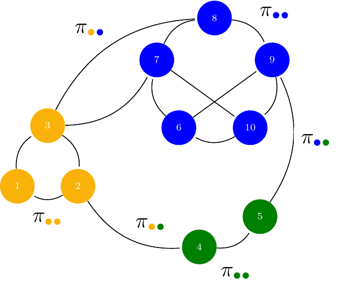
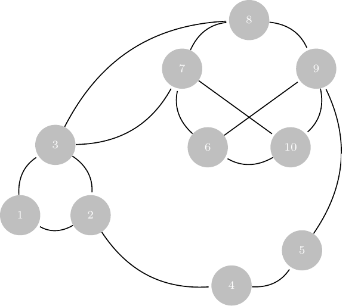
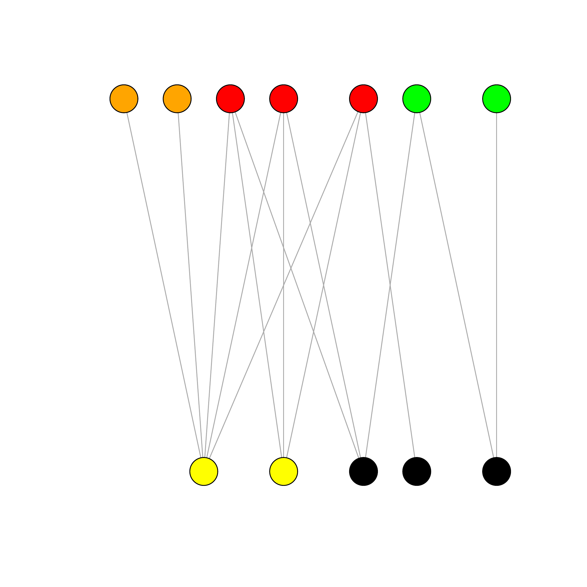

## Preliminary {.unnumbered}

Functions from `R`-base and stats (preloaded) are required plus packages from the **tidyverse** for data representation and manipulation. The package **igraph** is a great library for network data manipulation (interface exists in `Python`). We will also use the package **aricode** for computing clustering metrics. **sbm** and **missSBM** are used to adjust stochastic blockmodels.


```{r tests-config, message = FALSE}
#| code-fold: false
library(tidyverse)
library(corrplot)
library(viridis)
library(igraph)
library(aricode)
library(missSBM)
library(sbm)
theme_set(theme_bw())
```

```{r pdf-setting}
options(tinytex.engine = 'xelatex')
```

## Introduction: the French political Blogosphere

We continue our example on the French political blogosphere

The `frenchblog2007` data is a network dataset which consists of a single day snapshot of over 200 political blogs automatically extracted the 14 October 2006 and manually classified by the "Observatoire Présidentielle" project. It is part of the **missSBM** package. It is provided as an **igraph** object with 196 nodes. The vertex attribute "party" provides a classification of the nodes.

```{r mixture-fblog-load2}
#| code-fold: TRUE
data("frenchblog2007")
summary(frenchblog2007)
igraph::V(frenchblog2007)$party %>% table() %>% as_tibble() %>% rmarkdown::paged_table()
blog <- frenchblog2007 %>%  delete_vertices(which(degree(frenchblog2007) <= 1))
party <- V(blog)$party %>% as_factor()
Y     <- blog %>% as_adjacency_matrix()
n_nodes <- gorder(blog)
n_edges <- gsize(blog)
party %>% table() %>% as_tibble() %>% rmarkdown::paged_table()
plot.igraph(frenchblog2007,
  vertex.color = factor(V(frenchblog2007)$party),
  vertex.label = NA
 )
```

## Model-based clustering for graph data

::: {.callout-note}
## Motivation

We are still looking for an underlying organization in a observed network, yet with model-based approaches, so that statistical inference would be possible.

This session essentially aims to present the **stochastic block model**, a random graph model tailored for clustering vertices. As will be seen, this model is can be interpreted as a special mixture model for graph data. Hence, the relationship between spectral clustering for network and the Stochastic block model is the same as the one between the k-means clustering  and Gaussian mixture models. 
:::

Recall that the connectivity of a binary undirected (symmetric) graph $\mathcal{G} = (\mathcal{V},\mathcal{E})$ is captured by the $|\mathcal{V}|\times |\mathcal{V}|$ matrix $Y$, called the adjacency matrix
$$
  (Y)_{ij} = \begin{cases}
  1  & \text{ if } i \sim j,\\
  0  & \text{otherwise}.
\end{cases}
$$
For a valued of weighted graph, a similar definition would be

$$
  (Y)_{ij} = \begin{cases}
  w_{ij}  & \text{ if } i \sim j,\\
  0  & \text{otherwise}.
\end{cases}
$$
where $w_{ij}$ is the weight associated with edge $i\sim j$.


### The Erdös-Renyi model

We start by the most simple, yet natural model for random graph, the Erdös-Rényi model.

::: {#def-erdosRenyi}
## Erdös-Rényi model

Let $\mathcal{V} = {1,\dots,n}$ be a set of fixed vertices. The (simple) Erdös-Rényi model $\mathcal{G}(n,\pi)$ assumes random edges between pairs of nodes with probability $\pi$. In orther word, the (random) adjacency matrix $Y$ is such that

$$
  Y_{ij} \sim \mathcal{B}(\pi)
$$

:::


A direct consequence is that the distribution of the (random) degree $D_i$ of a vertex $i$ follows a binomial distribution, i.e.,

$$D_i \sim b(n -1, \pi).$$


```{r erdos-examples}
G1 <- igraph::sample_gnp(10, 0.1)
G2 <- igraph::sample_gnp(10, 0.9)
G3 <- igraph::sample_gnp(100, .02)
par(mfrow=c(1,3))
plot(G1, vertex.label=NA) ; plot(G2, vertex.label=NA)
plot(G3, vertex.label=NA, layout=layout.circle)
```


Because of its simplicity, a lot of mathematical derivation can be done with this model, yet its utility for adjusting real-world network is very limited since

- the degree distribution is too concentrated, with no high degree nodes,
- All nodes are equivalent, 
- No modularity is observed.

For instance, for the graph `G3` sampled above, the empirical degree distribution and and basic clustering support the over homogeneous structure of the ER model.

```{r, echo = FALSE}
par(mfrow=c(1,2))
hist(degree(G3), col="lightblue"); plot(cluster_fast_greedy(G3), G3)
```

### The Stochastic Block Model (SBM)

The SBM generalizes the Erdös-Rényi model in a mixture framework (see @Nowicki2001, @daudin2008mixture). It provides

- a statistical framework to adjust and interpret the parameters
- a flexible yet simple specification that fits many existing network data

::: {.callout-tip}
## Stochastic Block Model: definition

Let 

- $\{1, \dots, n \}$ be some *fixed* nodes,
- with some **unknown** $K$ colors picked up from $\mathcal{C}=\{{\color{#fab20a}{\bullet}},{\color{#0000ff}{\bullet}},{\color{#008000}{\bullet}}\}$

Denote by

- $\alpha_\bullet  =  \mathbb{P}(i  \in  \bullet)$, $\bullet\in\mathcal{C}$ the prior probability of group memberships,
- $\pi_{{\color{#fab20a}{\bullet}}{\color{#0000ff}{\bullet}}} = \mathbb{P}(i \leftrightarrow j | i\in{\color{#fab20a}{\bullet}},j\in{\color{#0000ff}{\bullet}})$, the probability of connection between groups.

In the binary Stochastic Block Model, the adjacency matrix $Y_{ij}$ is random, with probability of connection between a dyad $(i,j)$ being defined conditionally on their respective group memberships, described by a vector of random variables $(Z_i)_{i=1,\dots,n}$.

$$
\begin{aligned}
Z_i =  \bullet  \ & \sim^{\text{iid}} \mathcal{M}(1,\alpha), \\ 
Y_{ij} \ | \ \{i\in{\color{#fab20a}{\bullet}},j\in{\color{#0000ff}{\bullet}}\}
& \sim^{\text{ind}} \mathcal{B}(\pi_{{\color{#fab20a}{\bullet}}{\color{#0000ff}{\bullet}}})\\
\end{aligned}
$$
:::

```{r,fig.cap = "The binary SBM model", echo = FALSE, out.width="50%", fig.align='center'}

```

#### A generative model

The SBM does not assume assume any particular a priori structure of the network: because it is a probabilistic, generative model, we can easy simulate SBM-based network data with various topologies Here are a few examples:

- Community network

```{r sample-sbm-community}
pi <- matrix(c(0.3,0.02,0.02,0.02,0.3,0.02,0.02,0.02,0.3),3,3)
communities <- igraph::sample_sbm(100, pi, c(25, 50, 25))
par(mfrow = c(1,2))
plot(communities, vertex.label=NA, vertex.color = rep(1:3,c(25, 50, 25)))
corrplot(as_adj(communities, sparse =FALSE), tl.pos = "n", cl.pos = 'n')
```

- Star network

```{r sample-sbm-star}
pi <- matrix(c(0.05,0.3,0.3,0),2,2)
star <- igraph::sample_sbm(100, pi, c(4, 96))
par(mfrow = c(1,2))
plot(star, vertex.label=NA, vertex.color = rep(1:2,c(4,96)))
corrplot(as_adj(star, sparse =FALSE), tl.pos = "n", cl.pos = 'n')
```

- Bipartite network

```{r sample-sbm-bipartite}
pi <- matrix(c(.2,1-.2,.2,.2,1-.2,.2,.2,.2,.2,.2, .2,1-.2,.2,.2,1-.2,.2),4,4)
bipar <- igraph::sample_sbm(100, pi, c(15, 35, 5, 45))
par(mfrow = c(1,2))
plot(bipar, vertex.label=NA, vertex.color = rep(1:4,c(15, 35, 5, 45)))
corrplot(as_adj(bipar, sparse =FALSE), tl.pos = "n", cl.pos = 'n')
```

#### Degree distribution

Because it is defined as a simple mixture of Erdös-Rényi, the degree distribution of the binary SBM has a simple close form

::: {#def-degreeSBM}
## SBM: Degree distribution

The conditional degree distribution of a node $i\in q$ is

$$
  D_i | i \in k \sim \mathrm{b}(n-1,\bar\pi) \approx \mathcal{P}(\lambda_k), \qquad \bar\pi_k = \sum_{\ell=1}^K \alpha_\ell \pi_{k\ell}, \quad \lambda_k = (n-1)\bar\pi_k
$$

From this, we deduce the degree distribution of a node $i$, which can be approximated by a mixture of Poisson distributions:

$$
  \mathbb{P}(D_i = d) = \sum_{k=1}^K\alpha_k \exp(-\lambda_k) \ \frac{\lambda_k^d}{d !}
$$

:::


## Estimation: Variational Inference of the binary SBM

### SBM: a latent variable model

Recall that we have  *fixed* nodes $\{1, \dots, n \}$ with **hidden** colors $\mathcal{C}=\{\color{#fab20a}{\bullet},\color{#0000ff}{\bullet},\color{#008000}{\bullet}\}$. 
We observe the following

```{r sbm-inference, out.width='40%', echo = FALSE, fig.align='center'}

```

We need to estimate the model parameters and the clustering:

- $\theta = \{\boldsymbol\alpha = (\alpha_\bullet), \boldsymbol\Pi = (\pi_{\color{#fab20a}{\bullet}\color{#0000ff}{\bullet}})\}$
- Colors of $i$, i.e. the $\mathbf{Z} = (Z_i)$ (the clustering)

Just like with Gaussian mixture models, maximizing the marginal log likelihood is not straightforward

$$\ell_\theta(\mathbf{Y}_i) = \log p_\theta(\mathbf{Y}_i) = \log \int_{\mathcal{Z}} \prod_{(i,j)} p_\theta(Y_{ij} | Z_i, Z_j ) \, p_\theta(\mathbf{Z}) \mathrm{d}\mathbf{Z}$$

Integration over $\mathcal{Z} = \otimes_{k=0,\dots,K}\{1,\dots, C_k\}^{n_k}$ is intractable: we have $\mathrm{card}(C)^n$ terms! Like for mixture models, Expectation-Maximization seems to be the appropriate solution in the first place...

### EM does not work genuinely for SBM

To maximum the likelihood via an EM algorithm, we use the following decomposition of the log-likelihood:

$$\log p_\theta(\mathbf{Y}) = \mathbb{E}_{p_\theta(\mathbf{Z}\,|\,\mathbf{Y})} [\log p_\theta(\mathbf{Y}, \mathbf{Z})] + \mathcal{H}[p_\theta(\mathbf{Z}\,|\,\mathbf{Y})], \quad \text{ with } \mathcal{H}(p) = -\mathbb{E}_p(\log(p))$$ 

Then, we iterate the two following steps until convergence: 

  1. **Step E**: compute 

$$Q(\theta | \theta^{(t-1)}) =   \mathbb E_{\mathbf{Z} | \mathbf{Y}, \theta^{(t-1)} } \left[\log \ell_c(\mathbf{Y},\mathbf{Z}; \theta)  \right]$$
 
  2. **Step M**: solve 
 
$$ \theta^{(t)} = \arg \max_{\theta} Q(\theta | \theta^{(t-1)})$$

An important ingredient to compute the conditional expectation above is the complete data likelihood which, for binary SBM, is given by the following expression:

$$\begin{aligned}
\ell_c(\theta;\mathbf{Y},\mathbf{Z})  & =  p(\mathbf{Y} | \mathbf{Z}; \boldsymbol\pi) p(\mathbf{Z} ; \boldsymbol\alpha) \\
& =  \prod_{i<j} \pi_{Z_i,Z_j}^{Y_{ij}} (1-  \pi_{Z_i,Z_j})^{1- Y_{ij}}    \prod_{i} \alpha_{Z_i} \\
& =  \prod_{i<j} \prod_{k,\ell} \left(\pi_{k\ell}^{Y_{ij}} (1-  \pi_{k\ell})^{1- Y_{ij}}\right)^{\mathbf{1}_{\{Z_i = k\}}\mathbf{1}_{\{Z_i = \ell\}}} \prod_{i}\prod_k \left(\alpha_{k}\right)^{\mathbf{1}_{\{Z_i = k\}}} \\
\end{aligned}$$

With SBM, we have 

$$\mathbb{E}_{\mathbf{Z}|\mathbf{Y}} \big[\log \ell_c(\boldsymbol\theta;\mathbf{Y},\mathbf{Z}) \big] = \sum_{i,k} \tau_{ik} \log \alpha_k + \sum_{i<j,k,\ell} \eta_{ijk\ell} \log \pi_{k\ell}^{Y_{ij}} (1-\pi_{k\ell})^{1-Y_{ij}}$$
    
where $\tau_ {iq}, \eta_{ijq\ell}$ are the posterior probabilities:

  - $\tau_{ik} = \mathbb{P}(Z_i = k | \mathbf{Y}) = \mathbb{E} \left[\mathbf{1}_{\{Z_i = k\}} | \mathbf{Y}\right].$
  - $\eta_{ijk\ell} = \mathbb{P}(Z_i = k , Z_j = \ell | \mathbf{Y}) = \mathbb{E} \left[\mathbf{1}_{\{Z_i = k\}}\mathbf{1}_{\{Z_j = \ell\}} | \mathbf{Y}\right].$

::: {.callout-warning}
## Intractable EM

EM requires to evaluate (some moments of)  $p_\theta(\mathbf{Z}\,|\,\mathbf{Y})$, which is not known for the SBM (and was explicit for Gaussian mixture models). In particular, we do not have close forms for the $\eta_{ijk\ell}$'s.

One could use (at least)

- MCMC/Bayesian approaches for evaluating quantities depending on $p_\theta(\mathbf{Z}\,|\,\mathbf{Y})$
- Variational approaches, which generalize EM by approximating $p_\theta(\mathbf{Z}\,|\,\mathbf{Y})$

:::

### Variational approach: general case

The idea is to find a proxy $q_\psi(\mathbf{Z}) \approx p_\theta(\mathbf{Z} | \mathbf{Y})$ picked in a convenient class of distribution $\mathcal{Q}$

$$q(\mathbf{Z})^\star  \arg\min_{q\in\mathcal{Q}} D\left(q(\mathbf{Z}), p(\mathbf{Z} | \mathbf{Y})\right).$$

Küllback-Leibler  is a popular choice where *error averaged wrt the approximated distribution)*

$$KL\left(q(\mathbf{Z}), p(\mathbf{Z} | \mathbf{Y})\right) = \mathbb{E}_q\left[\log \frac{q(z)}{p(z)}\right] = \int_{\mathcal{Z}} q(z) \log \frac{q(z)}{p(z)} \mathrm{d}z.$$


For mixture model, the natural class of distribution used for approximation is the multinomial

$$\mathcal{Q} = \Big\{q_\psi: \, q_\psi(\mathbf{Z}) = \prod_i q_{\psi_i}(\mathbf{Z}_i), \, q_{\psi_i}(\mathbf{Z}_i) = \mathcal{M}\left(\mathbf{Z}_i; \boldsymbol\tau_i\right), \, \psi_i = \{\boldsymbol{\tau}_i\}, \boldsymbol{\tau}_i \in  \mathbb{R}^{K} \Big\}$$

And we maximize the ELBO (Evidence Lower BOund), a lower bound of the log-likelihood:

$$J(\theta, \psi) = \log p_\theta(\mathbf{Y}) - KL[q_\psi (\mathbf{Z}) ||  p_\theta(\mathbf{Z} | \mathbf{Y})]  = \mathbb{E}_{q} [\log p_\theta(\mathbf{Y}, \mathbf{Z})] + \mathcal{H}[q_\psi(\mathbf{Z})]$$

The variational EM has the following form

  1. Initialization: get $\mathbf{T}^0 = \{\tau_{ik}^0\}$ with Absolute Spectral Clustering

  2. M step: update $\theta^h = \{ \boldsymbol\alpha^h, \boldsymbol\Pi^h\}$

  3. VE step: find the optimal $q_\psi$, by updating $\psi^h= (\psi^h_{i})_i = \mathbf{T}^{h} = \mathbb{E}_{q^{h}} (\mathbf{Z})$:

$$\psi^h = \arg \max J(\theta^h, \psi) = \arg\min_{\psi} KL[q_\psi(\mathbf{Z}) \,||\, p_{\theta^h}(\mathbf{Z}\,|\,\mathbf{Y})]$$

$$\theta^h = \arg\max J(\theta, \psi^h) = \arg\max_{\theta} \mathbb{E}_{q_{\psi^h}} [\log p_{\theta}(\mathbf{Y}, \mathbf{Z})]$$


### Variational EM for SBM: ingredients

We now derive the quantity for the special case of SBM:

#### Variational bound


$$J(\theta, \tau ; \mathbf{Y}) = \sum_{i<j} \sum_{k,\ell} \tau_{ik} \tau_{j\ell} \log b(Y_{ij},\pi_{k\ell }) + \sum_{i} \sum_{k} \tau _{ik} \log (\alpha_k/\tau_{ik})$$


#### M-step (Analytical)


$$\alpha_k = \frac{1}{n} \sum_{i} \tau_{i k} , \quad  \pi_{k\ell } = \frac{\sum_{(i,j)} \tau_{ik}\tau_{j\ell} Y_{ij}}{\tau_{ik}\tau_{j\ell}} \qquad \left({\boldsymbol\alpha} = \mathbf{1}_n^\top\mathbf{T}, \quad {\boldsymbol\Pi} =  \frac{\mathbf{T}^\top \mathbf{Y} \mathbf{T}}{\mathbf{T}^\top  \mathbf{T}} \right)$$

#### Variational E-step (fixed point)


$$\tau_{ik} \varpropto \alpha_k \prod_{(i,j)} \prod_{\ell} b(Y_{ij} ; \pi_{k\ell})^{\tau_{j\ell}}$$

#### Model Selection

Rather than using the BIC, we use a variational equivalent where the log-likelihood is replaced by its surrogate:

$$\mathrm{vBIC}(Q) = - 2 J(\hat{\boldsymbol\tau},\hat{\boldsymbol\theta}) +  \left(\frac{K(K+1)}{2} \log \frac{n(n-1)}{2} + (K-1) \log (n) \right).$$

The Integrated Classification Likelihood is a preferred variant where we do not include the entropy in the term measuring the fit to the data: 

$$\mathrm{vICL}(K) = - 2 \mathbb{E}_{q} [\log L(\hat{\theta)}; \mathbf{Y}, \mathbf{Z}] + \left(\frac{K(K+1)}{2} \log \frac{n(n-1)}{2} + (K-1) \log (n) \right)$$

### SBM: the french blogosphere

There exist a variety of packages to fit SBM: we advice here using **sbm** and **misssbm** to stick to the course[^5]

[^5]: I have been involved in their development and they share some classes and have very similar interfaces

```{r fblog-simpleSbm-analysis, cache = TRUE}
blocks <- 1:18
sbm_full <- estimateMissSBM(as_adj(blog), blocks, "node")
```

#### Convergence monitoring (ELBO)

```{r fblog-simpleSbm-analysis-plot1}
plot(sbm_full, "monitoring")
```

#### Model Selection (vICL)

```{r fblog-simpleSbm-analysis-plot2}
plot(sbm_full)
```

#### Parameters

```{r fblog-simpleSbm-analysis-theta}
plot(sbm_full$bestModel, "meso")
```

#### Clustering I

```{r fblog-simpleSbm-analysis-plot3}
plot(sbm_full$bestModel, dimLabels = list(row = "blogs", col = "blogs"))
```

#### Clustering II

```{r fblog-simpleSbm-analysis-plot4}
plot(sbm_full$bestModel, "expected", dimLabels = list(row = "blogs", col = "blogs"))
```

## SBM: extensions

### Including effects of external covariates

Le  ($Y_{ij}$) be the adjacency matrix and let $x^{ij} \in \mathbb{R}^p$  denote some covariates describing associated to the pair $(i,j)$.

As before, we consider the nodes $i= \{1,\dots,n\}$ partitioned into $K$ clusters, where 
the latent variables $Z_i$ such as  $\mathbb{P}(Z_i = k) = \alpha_k$ describes the node memberships.

Then, conditionally to $(Z_i)_{i=1,\dots,n}$, the $(Y_{ij})$ are independent and 

$$Y_{ij}  | Z_i, Z_j \sim   \mathcal{B}ern(\mathrm{logit}(\alpha_{Z_i,Z_j} + \theta \cdot x_{ij}) ) \quad \textrm{if binary data}$$

If $K = 1$ : all the connection heterogeneity is explained by the covariates. Otherwise, the underlying organisation is explained by weighting of the covariates and the clustering.

### Valued-edges network

Information on edges can be something different from presence/absence (i.e., binary). It can be:

-  a count of the number of observed interactions,
- a quantity interpreted as the interaction strength,

In this case, natural extensions of SBM were introduced by @wsbm

- Poisson distribution: 

$\mathcal{C}=\{{\color{#fab20a}{\bullet}},{\color{#0000ff}{\bullet}},{\color{#008000}{\bullet}}\}$

$$Y_{ij} \ | \ \{i\in{\color{#fab20a}{\bullet}},j\in{\color{#0000ff}{\bullet}}\} \sim^{\text{ind}} \mathcal{P}(\lambda_{{\color{#fab20a}{\bullet}}{\color{#0000ff}{\bullet}}}),$$

- Gaussian distribution: 

$$Y_{ij} \ | \ \{i\in{\color{#fab20a}{\bullet}},j\in{\color{#0000ff}{\bullet}}\} \sim^{\text{ind}} \mathcal{N}(\mu_{{\color{#fab20a}{\bullet}}{\color{#0000ff}{\bullet}}},\sigma^2),$$

- More generally, 

$$Y_{ij} \ | \ \{i\in{\color{#fab20a}{\bullet}},{j\in\color{#0000ff}{\bullet}}\} \sim^{\text{ind}} \mathcal{F}(\theta_{{\color{#fab20a}{\bullet}}{\color{#0000ff}{\bullet}}}).$$

### Bipartite SBM aka Latent Block Models

Beyond network, we can consider several sets of interacting entities. For instance, for two sets, we have bipartite SBM (which generalizes to multi-partite SBM):

Let $Y_{ij}$ be a bi-partite network (that is, a rectangular matrix). Individuals in rows and columns are not the same: row nodes $i= 1,\dots,n_1$ are partitioned into $K_1$ clusters, and col nodes $j= 1,\dots,n_2$  partitioned into $K_2$ clusters, by the following latent variables:

  - $Z^1_i = k$ if node $i$ belongs to cluster (block) $k$,
  - $Z^2_j = \ell$ if node $j$ belongs to cluster (block) $\ell$

where $Z^1_i, Z^2_j$ are independent $\mathbb{P}(Z^1_i = k) = \alpha^1_k,\quad  \mathbb{P}(Z^2_j = \ell) = \alpha^2_\ell$

In a nutshell,

```{r,fig.cap = "binary Bipartite SBM model", echo = FALSE, out.width="50%", fig.align='center'}

```

- $n_1$ row nodes $\mathcal{K}_1=\{{\color{#ff0000}{\bullet}},{\color{#fab20a}{\bullet}},{\color{#00ff00}{\bullet}}\}$ classes
- $\alpha^1_\bullet  =  \mathbb{P}(i  \in  \bullet)$, $\bullet\in\mathcal{K}_1,i=1,\dots,n$
- $n_2$ column nodes $\mathcal{K}_2=\{{\color{#ffff00}{\bullet}},\color{black}{\bullet}\}$ classes
-   $\alpha^2_\bullet  =  \mathbb{P}(j  \in  \bullet)$, $\bullet\in\mathcal{K}_2,j=1,\dots,m$
- $\pi_{{\color{#ff0000}{\bullet}}{\color{#ffff00}{\bullet}}}   = \mathbb{P}(i \leftrightarrow j | i\in{\color{#ff0000}{\bullet}},j\in{\color{#ffff00}{\bullet}})$

$$\begin{aligned}
Z^1_i  \ & \sim^{\text{iid}} \mathcal{M}(1,\boldsymbol\pi^1), \quad \forall\bullet \in \mathcal{Q}_1, \\ 
Z^2_j  \ & \sim^{\text{iid}} \mathcal{M}(1,\boldsymbol\pi^2), \quad \forall\bullet \in \mathcal{Q}_2, \\
Y_{ij} \ | \ \{i\in{\color{#ff0000}{\bullet}},j\in{\color{#ffff00}{\bullet}}\}
& \sim^{\text{ind}} \mathcal{B}ern(\alpha_{\color{#ff0000}{\bullet}\color{#ffff00}{\bullet}})\\
\end{aligned}$$

## References {.unnumbered}
